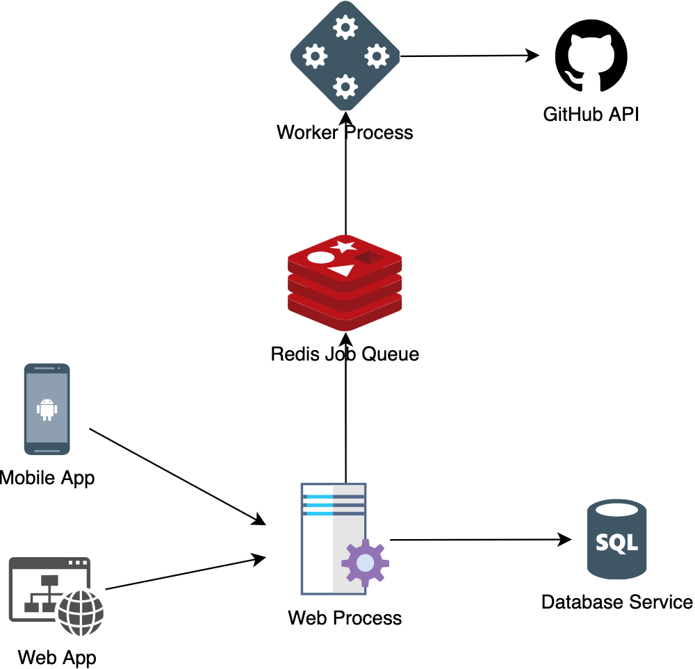

### What is AWESOME ?

Awesome or Awesome lists are the largest and most popular open source collection of cool internet resources.
[sindresorhus/awesome](https://github.com/sindresorhus/awesome) is in fact 8. most starred repository on all of Github.
Anyone can contribute their internet findings and expand collection. 

### Why I build this ?

I browse awesome collection quite often. 
For example, I may be looking for a cool development tool or just exploring awesome stuff in my free time.
Because this collection is so large (has a few 100.000 records), it may be time-consuming and non practical to find just the thing you are looking for.
I was using the existing search solutions like [Awesome Indexed](https://awesome-indexed.mathew-davies.co.uk/) or [awesomelists.top](https://awesomelists.top/).
What I didn't like about those solutions is that there is no visual preview of the content for the user, 
so the user always has to click the link and go to the source to check it out.
Because of that I decided that I would try to build another search solution myself.

### How I build it

This app consists of two separate processes:

- *web process*
    - receives HTTP requests from clients
    - dispatches jobs to redis queue
    - performs search queries
    - interacts with database
- *worker process*
    - performs website scraping
    - list parsing
    - website screenshots

